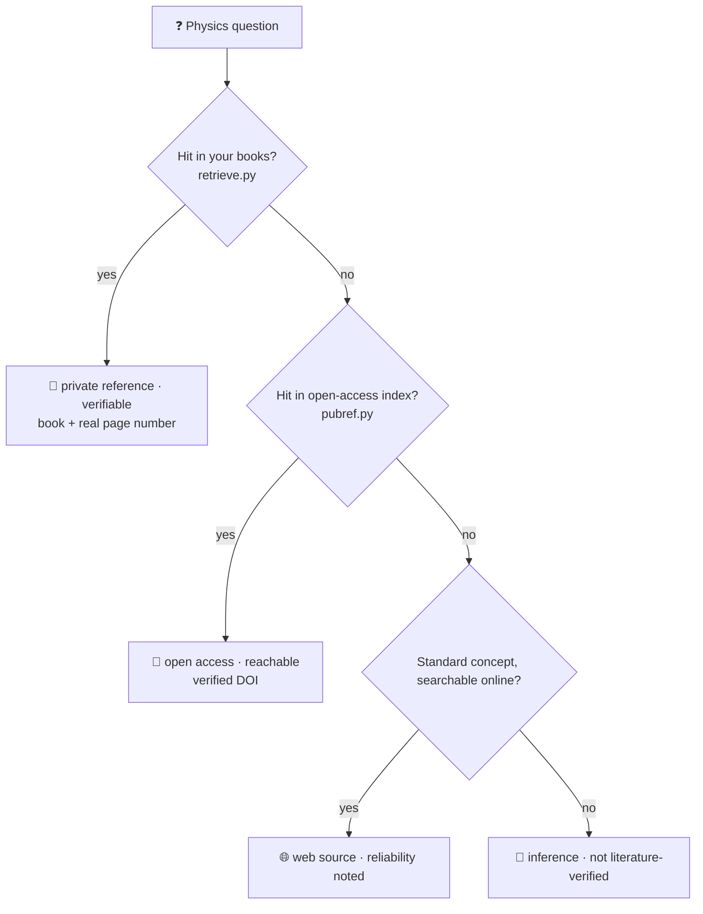

<div align="center">

# 🎯 accel-physics-writing

### A **Claude Code & Codex skill** for accelerator-physics & beam-dynamics research writing

*Sourced, verifiable answers for your papers, talks and notes — not confident guesses.*

**English** · [简体中文](README.zh-CN.md)

[](LICENSE)


by **Yaxin Hu (胡雅欣)** · [@hhuyaxin](https://github.com/hhuyaxin)

</div>

---

## What is this?

`accel-physics-writing` is an **AI-assistant skill** for accelerator physics and beam dynamics.
You install it into [Claude Code](https://claude.com/claude-code) (or any agent that reads `AGENTS.md`,
such as OpenAI Codex), then ask physics questions while writing. Instead of answering from memory, the
skill **looks things up first** and tells you **where every claim comes from** — down to the **page number**
of a textbook when it can, and an explicit *"this is my inference, please verify"* when it cannot.

> **Why it exists.** An LLM produces a correct statement and a hallucination through the same mechanism —
> it cannot tell which of its own answers is reliable. This skill does not rely on a *"please don't make
> things up"* prompt. It enforces reliability through **real, searchable sources + a strict fallback ladder**:
> if a claim cannot be sourced, the skill *cannot* dress it up as if it were.

---

## A real example

> **You ask:** What exactly is space charge in accelerator physics?
>
> **It answers (excerpt):**
> Space charge is the collective self-field produced by the Coulomb interaction between like-charged
> particles in a beam; its dominant term is the self-consistent potential of the smoothed charge distribution…
>
> 📖 `[私有参考·可验证]` *(private reference · verifiable)* — Hofmann, *Space Charge Physics for Particle Accelerators*, **PDF p.71** (Eq. 5.12: the repulsive field lowers the tune)
> 🔗 `[开放获取·可访问]` *(open access · reachable)* — G. Franchetti, *Space Charge in Circular Machines*, CAS 2017, **DOI 10.23730/CYRSP-2017-003.353** (CC-BY)

The tag after each statement is its *reliability label* — see [How it works](#how-it-works).
More real transcripts (incl. honest fallback on out-of-scope questions) → **[EXAMPLES.md](EXAMPLES.md)**.

---

## Features

- 📖 **Page-level sourcing** — index *your own* textbook PDFs locally; answers cite the book and the **real page number** (the page comes from retrieval, never invented).
- 🌐 **Ask in Chinese, find it in English books** — multilingual vector search bridges your query language and the corpus.
- 🔗 **17 verified open-access references** — CERN-CAS / JUAS / PRAB, each with a **real, checked DOI**, spanning space charge, synchrotron radiation, FELs, linacs & rings, colliders, superconducting RF, diagnostics, and more.
- 🚫 **Anti-hallucination by design** — a four-tier source ladder; **page numbers and DOIs are never fabricated**.
- 🔒 **Fully offline, no API key, nothing leaves your machine** — local `sentence-transformers` embeddings.
- 🤖 **Works across assistants** — Claude Code (via `SKILL.md`) and OpenAI Codex (via `AGENTS.md`).
- ⚖️ **Copyright-clean** — it points you to *"see book X, page Y"* (a citation); it **never redistributes book text**.

---

## Installation

**Recommended — install once, use in *every* paper you write** (user-level skill):

```bash
git clone https://github.com/hhuyaxin/accel-physics-writing.git
cp -r accel-physics-writing/.claude/skills/accel-physics-writing ~/.claude/skills/
bash ~/.claude/skills/accel-physics-writing/setup.sh        # .venv + local model, no API key
```

Claude Code can now use the skill in **any** project. The skill is **self-contained**: its virtualenv,
the local model, and your book library all live inside the skill folder
(`~/.claude/skills/accel-physics-writing/`). Set `APW_HOME` to relocate that data if you prefer.

- **Project-level** (one project only): copy the skill into `<your-project>/.claude/skills/` instead.
- **OpenAI Codex / other agents:** clone the repo (or copy [`AGENTS.md`](AGENTS.md) + the skill into your project); the agent reads `AGENTS.md` and follows the same workflow.

**Unlock page-level citation** (optional — bring your own legally-owned books):

```bash
SKILL=~/.claude/skills/accel-physics-writing
cp your_book.pdf  "$SKILL/private_corpus/books/"
"$SKILL/.venv/bin/python"  "$SKILL/scripts/index_corpus.py"
```

Then just ask your questions — see [Supported assistants](#supported-assistants).
👉 **More worked transcripts** (cross-lingual, honest fallback, open-access): **[EXAMPLES.md](EXAMPLES.md)**

---

## How it works

Every theory answer follows a **four-tier fallback ladder** and stops at the first tier it can satisfy:



| Label (as emitted) | Meaning |
|---|---|
| `[私有参考·可验证]` | From your local textbook, with a real page number |
| `[开放获取·可访问]` | CERN-CAS / JUAS / PRAB / arXiv, with a verified DOI |
| `[网络来源·已核来源]` | Found online, reliability noted |
| `[推断·未经文献核实]` | Model inference, no source — verify it yourself |

> Labels are emitted in Chinese (the skill targets bilingual writing); the table above gives the English meaning.

---

## Supported assistants

| Assistant | How to use |
|---|---|
| **Claude Code** | Ships with `SKILL.md`; auto-triggers as a skill. Just ask after setup. |
| **OpenAI Codex / other agents** | The root [`AGENTS.md`](AGENTS.md) routes any `AGENTS.md`-aware agent to the same rules and scripts. Start it inside this repo and ask normally. |

> The skill's "brain" is `references/*.md` (the rules) + `scripts/*.py` (standalone retrieval), which are
> **agent-agnostic**. Different assistants are simply guided in through different entry points.

---

## Two ways to use it

**A. Works out of the box (no books).** Concept Q&A (falls back to verified open-access references),
bilingual glossary, concept map, and the derivation / review rule sets.

**B. Unlock page-level citation (bring your own books).** Drop legally-owned PDFs into
`private_corpus/books/` and run `index_corpus.py`; relevant questions then prefer `[私有参考·可验证]` + page.

> ⚠️ This project **never distributes any book**. Page-level citation only works on books *you* provide —
> the only clean form legally.

---

## Notes for users in China 🇨🇳

`setup.sh` ships a reliable mainland path out of the box:
- The local model is fetched from **ModelScope** by direct connection (HuggingFace is unstable for large files here and is avoided).
- pip can use the Tsinghua mirror: `PIP_INDEX_URL=https://pypi.tuna.tsinghua.edu.cn/simple bash setup.sh`

**Requirements:** Python 3.10+ (auto-detected). First run downloads deps + model (a few hundred MB); afterwards retrieval is fully offline.

---

## Project structure

```
.claude/skills/accel-physics-writing/
├── SKILL.md                 # Claude Code entry point (auto-trigger)
├── setup.sh                 # one-time setup (deps + model)
├── references/              # rules & public material (plain text, public)
│   ├── reference_locator_policy.md   # the fallback ladder (core)
│   ├── derivation_checks.md          # mechanical derivation checks
│   ├── document_review_checklist.md  # document physics review
│   ├── glossary_zh_en.md             # ZH–EN glossary (105 terms)
│   ├── concept_map.md                # concept relationship map
│   └── public_reference_index.yaml   # open-access index (verified DOIs)
└── scripts/
    ├── fetch_model.py / index_corpus.py / retrieve.py / pubref.py / _config.py
AGENTS.md                    # entry point for OpenAI Codex & other agents
private_corpus/              # your books & index — git-ignored, never committed
```

---

## Roadmap

- [x] **Ability A — sourced physics Q&A** (private page-level + open-access DOI ladder)
- [ ] **Ability B — mechanical derivation checks** (`check_algebra.py`: dimensional / algebraic verification with SymPy)
- [ ] **Ability C — whole-document / slide physics review** script
- [ ] Expand the open-access library (Chinese-language resources, more subfields)

---

## Copyright boundary

- What ships is a **tool + a public index + check rules**, not a built-in library you can read books from.
- *"See book X, page Y"* requires you to provide that book yourself; the project gives the pointer only and **never copies or redistributes** the text.
- A `[推断·未经文献核实]` label means the statement has no literature backing — verify it.

## Contributing

Issues and PRs welcome: add **verified** open-access references (a real, checkable DOI is required),
terms, concept-map entries, or implement a Roadmap item.

## Author

**Yaxin Hu (胡雅欣)** — GitHub [@hhuyaxin](https://github.com/hhuyaxin).
If this helps your research, a ⭐ is appreciated, and citations are welcome.

## License

[MIT](LICENSE) © 2026 Yaxin Hu
