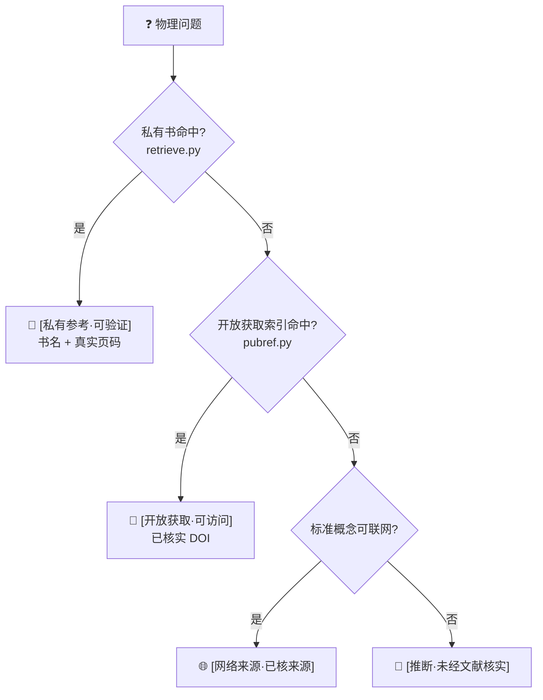

<div align="center">

# 🎯 accel-physics-writing

**加速器物理 / 束流动力学科研写作助手**
*A research-writing copilot for accelerator physics & beam dynamics*

帮你写论文、做 PPT、查概念时,给出**有出处、能核实的答案,而不是张口就来**。

[](LICENSE)


作者 / Author · **Yaxin Hu(胡雅欣)** · [@hhuyaxin](https://github.com/hhuyaxin)

</div>

---

## 这是什么?(一句话)

你问加速器物理的问题(比如"为什么会束损?""什么是空间电荷?"),它**先去查书和权威文献**再回答,
并明确告诉你**每句话的出处**——能查到书就给你**精确到第几页**,查不到就老实说"这是我的推断,请自行核实"。

> **为什么需要它?** AI 最大的毛病是"一本正经地胡说",连它自己都分不清哪句可靠。
> 本工具不靠"请不要瞎编"这种提示词,而是**用真实可检索的资料 + 强制分级**来保证可信——
> 查不到出处,它**没法**伪装成查到了。

---

## 🌟 一个真实例子

> **你问:** 到底什么是加速器物理中的 space charge?
>
> **它答(节选):**
> 空间电荷 = 束流里同号粒子通过**库仑力**相互作用产生的集体自场,主导项是把束流当连续电荷分布算出的**自洽势**……
>
> 📖 `[私有参考·可验证]` Hofmann《Space Charge Physics for Particle Accelerators》 **PDF p.71**(式 5.12:斥力使调谐下移)
> 🔗 `[开放获取·可访问]` G. Franchetti, *Space Charge in Circular Machines*, CAS 2017, **DOI 10.23730/CYRSP-2017-003.353**(CC-BY,可直接点开)

每条结论后面那个标签,就是它的"可信度身份证"。

---

## ✨ 特性

- 📖 **精确到页码的溯源** —— 把你**自己的**教科书 PDF 建成本地索引,回答时给出书名 + 真实页码(页码来自检索,不是编的)
- 🌐 **中文问、英文书也能查** —— 多语种向量检索,你用中文提问能召回英文教科书里的内容
- 🔗 **17 篇已联网核实的开放获取文献** —— CERN-CAS / JUAS / PRAB,带真实 DOI,覆盖空间电荷、同步辐射、FEL、直线/环形、对撞机、超导 RF、束流诊断等
- 🚫 **零幻觉机制** —— 四级来源标签 + 强制降级;**绝不伪造页码或 DOI**
- 🔒 **全程离线、零 API key、不外传** —— 你的书和文本不出本机
- 🤖 **多 AI 助手通用** —— Claude Code(skill)与 OpenAI Codex(AGENTS.md)都能用
- ⚖️ **版权干净** —— 只给"见某书第 X 页"的指向(=学术引用),**永不分发书籍正文**

---

## 🚀 快速开始

```bash
# 1) 克隆
git clone https://github.com/hhuyaxin/accel-physics-writing.git
cd accel-physics-writing

# 2) 一次性初始化:建 .venv、装依赖、下载本地模型(无需任何 API key)
bash .claude/skills/accel-physics-writing/setup.sh

# 3)(可选)放入你自己的书,解锁"页码定位"
cp 你的书.pdf  private_corpus/books/
.venv/bin/python .claude/skills/accel-physics-writing/scripts/index_corpus.py
```

装完直接问问题即可(见下方"支持的 AI 助手")。

---

## 🧠 工作原理:四级降级链

每个理论性回答都走这条链,**命中即停在该级并打标签**:



| 标签 | 含义 |
|---|---|
| `[私有参考·可验证]` | 来自你本地教科书,带真实页码 |
| `[开放获取·可访问]` | CERN-CAS / JUAS / PRAB / arXiv,带已核实的真实 DOI |
| `[网络来源·已核来源]` | 联网得到,已标可靠性 |
| `[推断·未经文献核实]` | 模型推断,无出处 —— 看到它就请自行核实 |

---

## 🤖 支持的 AI 助手

| 助手 | 怎么用 |
|---|---|
| **Claude Code** | 已含 `SKILL.md`,自动作为 skill 触发。装好后直接提问即可。 |
| **OpenAI Codex / 其它 agent** | 仓库根的 [`AGENTS.md`](AGENTS.md) 会引导它遵循同一套规则与脚本。在本仓库目录内启动 Codex,正常提问即可。 |

> 原理:工具的"大脑"是 `references/*.md`(规则)+ `scripts/*.py`(可独立运行的检索),**与具体 AI 无关**。
> 不同助手只是用不同入口(SKILL.md / AGENTS.md)被引导到同一套逻辑。

---

## 📚 两种用法

**A. 装上即用(不放任何书)** — 概念问答(降级到已核实的开放获取文献)、中英术语表、概念图、推导/审查规则。

**B. 解锁"页码定位"(放入你自己的书)** — 把合法持有的 PDF 放进 `private_corpus/books/` 并跑 `index_corpus.py`,
之后相关问题优先给 `[私有参考·可验证]` + 页码。

> ⚠️ 本项目**不分发任何书籍**;页码定位只对你自己提供的书生效。这是法律上唯一干净的形态。

---

## 🇨🇳 国内网络

`setup.sh` 已内置国内可靠方案,无需你折腾:
- 本地模型自动走 **ModelScope(魔搭)直连**(HuggingFace 对大文件不稳,已规避)
- pip 走清华源:`PIP_INDEX_URL=https://pypi.tuna.tsinghua.edu.cn/simple bash setup.sh`

**系统要求**:Python 3.10+(脚本自动探测);首次需联网下依赖+模型(约数百 MB),之后全程离线。

---

## 🗂️ 项目结构

```
.claude/skills/accel-physics-writing/
├── SKILL.md                 # Claude Code 入口(自动触发)
├── setup.sh                 # 一次性初始化(装依赖 + 下模型)
├── references/              # 规则与公开资料(纯文本,可公开)
│   ├── reference_locator_policy.md   # 降级链(核心)
│   ├── derivation_checks.md          # 推导机械检查
│   ├── document_review_checklist.md  # 文档物理审查
│   ├── glossary_zh_en.md             # 中英术语表(105 词)
│   ├── concept_map.md                # 概念关系图
│   └── public_reference_index.yaml   # 开放获取索引(已核实 DOI)
└── scripts/
    ├── fetch_model.py / index_corpus.py / retrieve.py / pubref.py / _config.py
AGENTS.md                    # OpenAI Codex 等通用入口
private_corpus/              # 你的书与索引 —— 整目录 .gitignore,绝不提交
```

---

## 🗺️ Roadmap

- [x] **能力 A — 有出处的物理问答**(私有页码 + 开放获取 DOI 降级链)
- [ ] **能力 B — 推导机械检查**(`check_algebra.py`:sympy 量纲/化简验证)
- [ ] **能力 C — 整篇文档/PPT 物理审查脚本**
- [ ] 扩充公开文献库(中文资源、更多子领域)

---

## ⚖️ 版权边界

- 开箱即用的是"**工具 + 公开索引 + 检查规则**",不是内置书库的问答机。
- "对着某书第 X 页"需你先放入**自己拥有**的书;本项目只给指向,**不复制、不分发**正文。
- 看到 `[推断·未经文献核实]` 即表示该结论无文献背书,请自行核实。

## 🤝 贡献

欢迎 Issue / PR:补充已核实的开放获取文献(**必须附可核实的真实 DOI**)、术语、概念图,或实现 Roadmap 中的能力。

## 👤 作者

**Yaxin Hu(胡雅欣)** — GitHub [@hhuyaxin](https://github.com/hhuyaxin)
觉得有用就点个 Star ⭐,也欢迎在论文/项目中引用。

## 📄 License

[MIT](LICENSE) © 2026 Yaxin Hu
