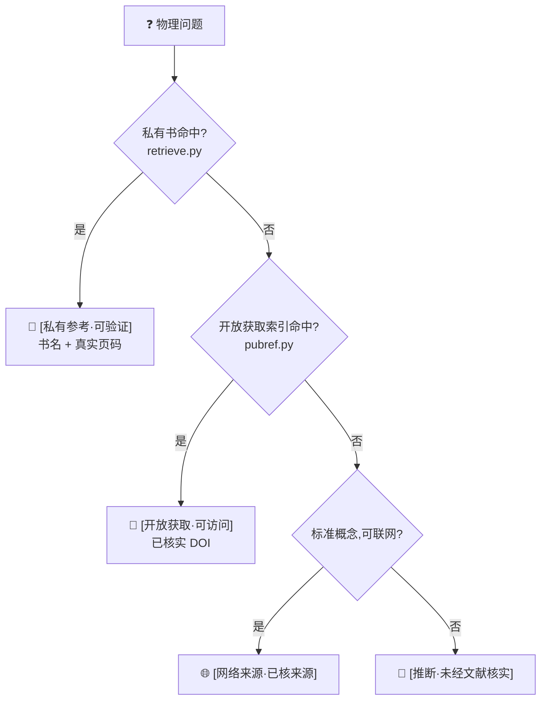

<div align="center">

# 🎯 accel-physics-writing

### 面向加速器物理与束流动力学科研写作的 **Claude Code / Codex 技能(skill)**

*写论文、做报告、查概念时,给出有出处、可核实的答案,而非看似笃定的猜测。*

[English](README.md) · **简体中文**

[](LICENSE)


作者 **Yaxin Hu(胡雅欣)** · [@hhuyaxin](https://github.com/hhuyaxin)

</div>

---

## 这是什么

`accel-physics-writing` 是一个面向加速器物理与束流动力学的 **AI 助手技能(skill)**。
你把它装进 [Claude Code](https://claude.com/claude-code)(或任何读取 `AGENTS.md` 的助手,例如 OpenAI Codex),
写作时提出物理问题,它**先检索资料再回答**,并标明**每条结论的出处**——能查到教科书时给出**具体页码**,
查不到时则明确说明"这是推断,请自行核实"。

> **为什么需要它。** 大模型生成一句正确陈述与一句幻觉,内部机制相同,它无法自知哪句可靠。
> 本技能不依赖"请不要编造"这类提示词,而是通过**真实可检索的资料 + 严格的分级降级**来保证可信:
> 一旦某结论无法溯源,它便**无法**把它伪装成有出处。

---

## 一个真实例子

> **你问:** 到底什么是加速器物理中的 space charge?
>
> **它答(节选):**
> 空间电荷是束流中同号粒子通过库仑力相互作用产生的集体自场,主导项是对平滑后电荷分布求得的自洽势……
>
> 📖 `[私有参考·可验证]` Hofmann《Space Charge Physics for Particle Accelerators》 **PDF p.71**(式 5.12:斥力使调谐下移)
> 🔗 `[开放获取·可访问]` G. Franchetti, *Space Charge in Circular Machines*, CAS 2017, **DOI 10.23730/CYRSP-2017-003.353**(CC-BY)

每条结论后面那个标签,就是它的"可信度标识"——见[工作原理](#工作原理)。
更多真实输出(含离题问题如实降级)→ **[EXAMPLES.md](EXAMPLES.md)**。

---

## 特性

- 📖 **精确到页码的溯源** —— 将**你自己的**教科书 PDF 建成本地索引,回答给出书名 + 真实页码(页码来自检索,而非生成)
- 🌐 **中文提问、英文书也能命中** —— 多语种向量检索,跨越提问语言与语料语言
- 🔗 **17 篇已核实的开放获取文献** —— CERN-CAS / JUAS / PRAB,均带**真实 DOI**,覆盖空间电荷、同步辐射、自由电子激光、直线与环形加速器、对撞机、超导 RF、束流诊断等
- 🚫 **以机制防幻觉** —— 四级来源降级链;**页码与 DOI 绝不伪造**
- 🔒 **全程离线、无需 API key、数据不出本机** —— 使用本地 `sentence-transformers` 向量模型
- 🤖 **多助手通用** —— Claude Code(`SKILL.md`)与 OpenAI Codex(`AGENTS.md`)皆可
- ⚖️ **版权干净** —— 只给"见某书第 X 页"的指向(即学术引用),**绝不分发书籍正文**

---

## 安装

**推荐 —— 装一次,以后写任何论文都能用**(用户级 skill):

```bash
git clone https://github.com/hhuyaxin/accel-physics-writing.git
cp -r accel-physics-writing/.claude/skills/accel-physics-writing ~/.claude/skills/
bash ~/.claude/skills/accel-physics-writing/setup.sh        # 建 .venv + 下本地模型,无需 API key
```

之后 Claude Code 在**任何项目**里都能用这个 skill。它是**自包含**的:虚拟环境、本地模型、你的书库
都放在 skill 文件夹内(`~/.claude/skills/accel-physics-writing/`)。想换位置就设 `APW_HOME`。

- **项目级**(只在某个项目用):改为把 skill 拷进 `<你的项目>/.claude/skills/`。
- **OpenAI Codex / 其它 agent**:克隆本仓库(或把 [`AGENTS.md`](AGENTS.md) + skill 拷进你的项目),agent 读 `AGENTS.md` 走同一套流程。

**解锁页码定位**(可选,放入你合法持有的书):

```bash
SKILL=~/.claude/skills/accel-physics-writing
cp 你的书.pdf  "$SKILL/private_corpus/books/"
"$SKILL/.venv/bin/python"  "$SKILL/scripts/index_corpus.py"
```

完成后直接提问即可——见[支持的助手](#支持的助手)。
👉 **更多真实示例**(跨语言、如实降级、开放获取):**[EXAMPLES.md](EXAMPLES.md)**

---

## 工作原理

每个理论性回答都走一条**四级降级链**,命中即停在该级并打标签:



| 标签 | 含义 |
|---|---|
| `[私有参考·可验证]` | 来自你本地教科书,带真实页码 |
| `[开放获取·可访问]` | CERN-CAS / JUAS / PRAB / arXiv,带已核实 DOI |
| `[网络来源·已核来源]` | 联网得到,已标可靠性 |
| `[推断·未经文献核实]` | 模型推断,无出处,请自行核实 |

---

## 支持的助手

| 助手 | 用法 |
|---|---|
| **Claude Code** | 自带 `SKILL.md`,自动作为 skill 触发;初始化后直接提问。 |
| **OpenAI Codex / 其它 agent** | 仓库根的 [`AGENTS.md`](AGENTS.md) 会把任何支持该约定的 agent 引导到同一套规则与脚本。在本仓库内启动并正常提问即可。 |

> 技能的"大脑"是 `references/*.md`(规则)与 `scripts/*.py`(可独立运行的检索),**与具体 AI 无关**;
> 不同助手只是经不同入口被引导到同一套逻辑。

---

## 两种用法

**A. 装上即用(不放书)** —— 概念问答(降级到已核实的开放获取文献)、中英术语表、概念图、推导与审查规则。

**B. 解锁页码定位(放入自己的书)** —— 把合法持有的 PDF 放进 `private_corpus/books/` 并运行 `index_corpus.py`,
之后相关问题优先给 `[私有参考·可验证]` + 页码。

> ⚠️ 本项目**不分发任何书籍**;页码定位只对你自己提供的书生效——这是法律上唯一干净的形态。

---

## 国内网络 🇨🇳

`setup.sh` 已内置国内可靠方案,无需额外配置:
- 本地模型自动从 **ModelScope(魔搭)直连**下载(HuggingFace 对大文件不稳,已规避)
- pip 可走清华源:`PIP_INDEX_URL=https://pypi.tuna.tsinghua.edu.cn/simple bash setup.sh`

**系统要求**:Python 3.10+(自动探测);首次需联网下载依赖与模型(约数百 MB),之后检索全程离线。

---

## 项目结构

```
.claude/skills/accel-physics-writing/
├── SKILL.md                 # Claude Code 入口(自动触发)
├── setup.sh                 # 一次性初始化(装依赖 + 下模型)
├── references/              # 规则与公开资料(纯文本,可公开)
│   ├── reference_locator_policy.md   # 降级链(核心)
│   ├── derivation_checks.md          # 推导机械检查
│   ├── document_review_checklist.md  # 文档物理审查
│   ├── glossary_zh_en.md             # 中英术语表(105 词)
│   ├── concept_map.md                # 概念关系图
│   └── public_reference_index.yaml   # 开放获取索引(已核实 DOI)
└── scripts/
    ├── fetch_model.py / index_corpus.py / retrieve.py / pubref.py / _config.py
AGENTS.md                    # OpenAI Codex 等 agent 的入口
private_corpus/              # 你的书与索引 —— 整目录 .gitignore,绝不提交
```

---

## 开发计划(Roadmap)

- [x] **能力 A — 有出处的物理问答**(私有页码 + 开放获取 DOI 降级链)
- [ ] **能力 B — 推导机械检查**(`check_algebra.py`:基于 SymPy 的量纲/化简验证)
- [ ] **能力 C — 整篇文档 / PPT 物理审查脚本**
- [ ] 扩充开放获取文献库(中文资源、更多子领域)

---

## 版权边界

- 开箱即用的是"**工具 + 公开索引 + 检查规则**",并非可阅读书籍的内置书库。
- "见某书第 X 页"需你先提供该书;本项目只给指向,**不复制、不分发**正文。
- `[推断·未经文献核实]` 标签表示该结论无文献背书,请自行核实。

## 贡献

欢迎 Issue / PR:补充**已核实**的开放获取文献(须附真实可核 DOI)、术语、概念图,或实现 Roadmap 中的能力。

## 作者

**Yaxin Hu(胡雅欣)** — GitHub [@hhuyaxin](https://github.com/hhuyaxin)。有用请点个 Star ⭐,欢迎在论文 / 项目中引用。

## 许可证

[MIT](LICENSE) © 2026 Yaxin Hu
